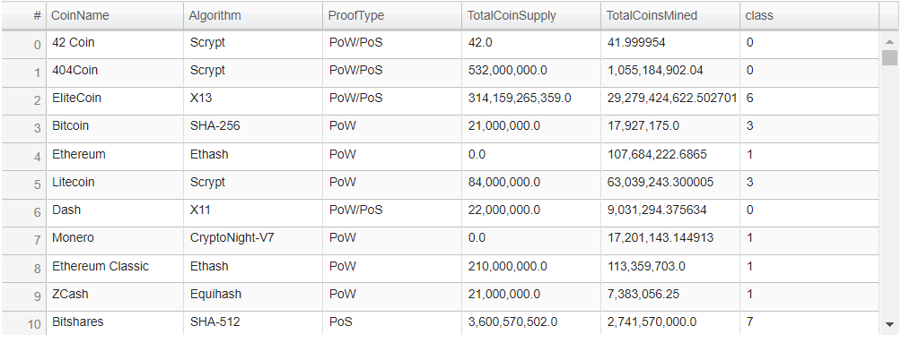

# Cryptocurrencies
## Unsupervised machine learning

### Background
Due to the rise of the cryptocurrencies, an investment bank is interested in offering new cryptocurrencies investment portfolio for its customers. A report of which cryptocurrencies are on the trading market and how cryptocurrencies could be grouped toward creating a classification for developing this new investment product is attempted to help build an investment portfolio.
The data in the form of a csv flat file is not ideal, and hence, it will be need to be processed to fit the machine learning models. Since there is no known output for what to look for, an unsupervised learning method is used. To group the cryptocurrencies, a clustering algorithm is created to help determine investing in cryptocurrencies.

### Resources
The following are used to perform this analysis and the Python code is written in Jupyter Notebook.

* pandas
* sklearn.cluster
* plotly.express
* hvplot.pandas
* sklearn.preprocessing
* sklearn.decomposition
* matplotlib

### Analysis

#### Data Preprocessing
The flat file 'crypto_data.csv' contains data for preprocessing.  It is imported into a dataframe while using the crytocurrency ticker as an index.  The data type of each of the columns is verified before starting the preprocessing.  The following steps were hence taken:
* removed all cryptocurrencies which do not have any algorithm mentioned
* selected only the cryptocurrencies that are trading
* dropped the column for trading/not trading entirely from the dataframe
* removed all cryptocurrencies which do not have any coins mined so far
* the TotalCoinSupply column contained some strings in the form of numbers and during the above process these got removed
* converted the TotalCoinSupply into a float data type as these are numbers
* stored all the CoinNames in a separate dataframe called coins_name and deleted the CoinName from the original dataframe

The following dataframe is the result of the preprocesing which is then used for unsupervised machine learning.

Using the variables, Algorithm and ProofType from the above dataframe, dummies variables are created.  The data is then standardized using StandardScalar from sklearn.

#### Reducing Data Dimensions

Using Eigenvectors, the PCA dimensions are reduced to 3 with a dataframe to be used for clustering.

#### Clustering Cryptocurrencies Using K-Means
AN elbow curve is created to provide a means to determine the number of K means and providing a predicted cluster.

A new dataframe is created by usind the predicted clusters by inner joining the previous dataframe crypto_df.

#### Visialization

A 3D-Scatter plot using the predicted clusters is then created

A data table with all the tradeable currencies is created to be able to scroll up and down.

Finally a 2D-Scatter plot is created between the TotalCoinsMined vs TotalCoinsSupply.

